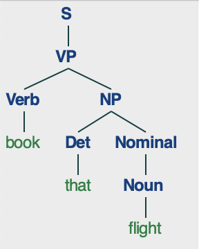

# README

## General Requirements

This program takes in as command line arguments both the grammar for the syntactical parse tree (a .cfg file) and the sentence to be parsed.

### Input (.cfg) File Format

Each line of the grammar file must either be a comment (which begins with the `#` character) or a rule.
All lines beginning with `#` will be ignored by the program.
All other lines must begin with a category, which must begin with an uppercase letter, followed by an arrow `->` and further categories or terminal states.
All these components must be seperated by a space (e. g. `S -> Cat terminal B C`).
Terminal states must be in lowercase letters.

### Sentence
The sentence must consist entirely of lowercase letters.
Recall that all terminal states (i. e. words in the sentence) must begin with lowercase letters.
All words must be separated by a space, as such: `the quick brown fox jumps over the lazy dog`.
Punctuation must be ignored for the sentence, since it is not included in the grammar and is not automatically removed by the program.
Avoid using contractions if they are not supported by the grammar file.

## How to Run

Each .cfg file in this repository contains instructions for how to run one test case in the top comment.
The program can be run by executing `python3 parser.py grammar.cfg "sentence"` in command line, where `grammar.cfg` is the file containing grammar rules, and `"sentence"` is the sentence to be parsed (as described in **General Requirements**).
Quotation marks around `sentence` are there because it allows for the entire sentence to be interpreted as one command line argument, despite words being seperated by spaces.

## Output

The ouput is all drawings of the legal parse trees for the sentence, which is displayed by using the `nltk.tree.Tree` class' `draw` method.
Notice that a second parse tree will not appear until the first window of a tree has been closed.
There are test cases available in this repository that have multiple parse trees.

 

## Additional Notes

### Assumptions Made

* All categories in the provided .cfg file must not begin with `X`.
This is because the program creates new labels in the sequence `X0, X1, X2...` in the preprocessing step and later removes them by identifying those that begin with `X`.

* All rules must lead to at least one category.

* No lines are empty in the file passed in.

### Good to know ...

* The Earley parser begins by expanding the state `Gamma -> . S [0,0]`.
Although this is represented slightly differently inside the code, it is important to notice that in order for there to be a syntactically correct parse tree, there must be rules of the form `S -> ...`.
Otherwise, the program will terminate quickly with no output, since the Earley parser is a top-down algorithm and there is no way to expand on `S`.

* Although the Earley parser does not include support for categories that are both POS tags (lead to terminal states) and non-POS tags, the code in `parser.py` does include modified logic to account for them.

* If you wish to implement the earley parser, beware that pseudocode typically does not mention invalid index errors (see the `scanner` function in `parser.py`).
Additionally, In order to build parse trees for the algorithm, the code in `parser.py` augments the state described above to also include working progress on a tree.
